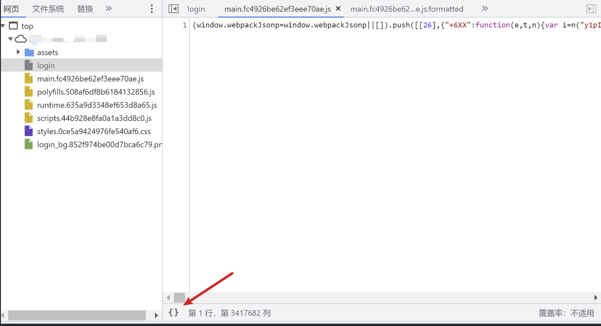
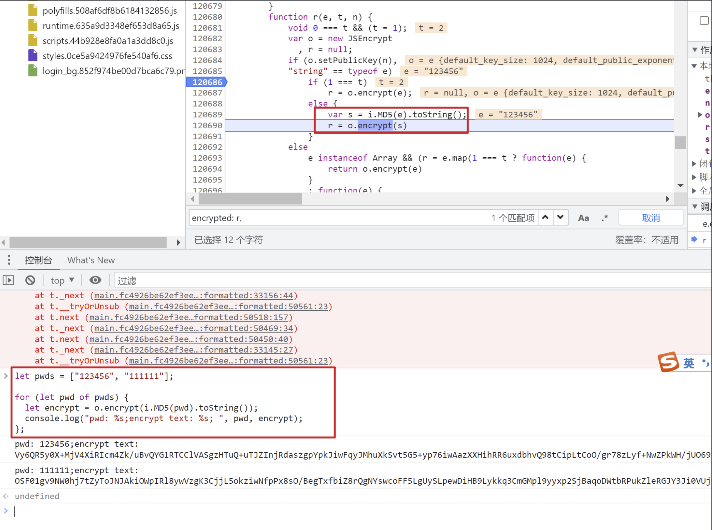
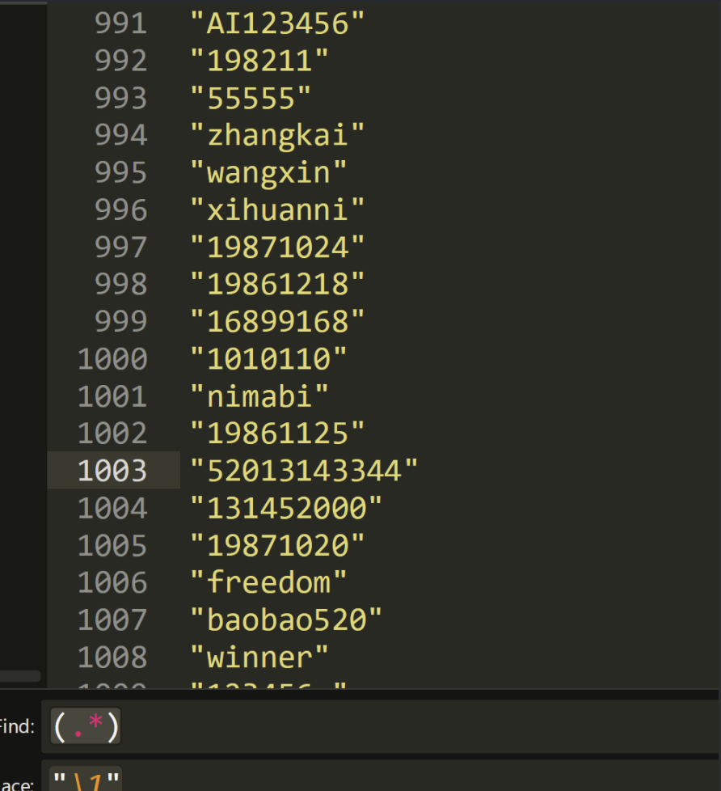
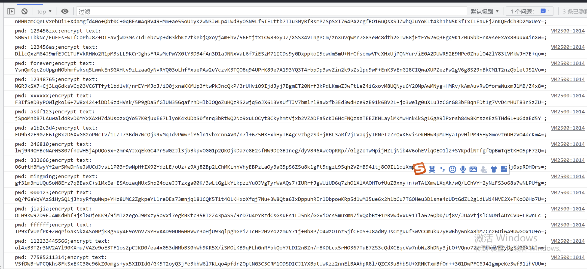

# 前言

一个前端加密相关的处理小工具，只是为了省点事。

原先使用burp加密插件的时候，我需要先分析好加密逻辑，然后扣出能单独跑的js代码，这样会使得js分析更费时，而如果在浏览器下断点在最终加密处，有现成的上下文可以在console里调用，和IDE里使用eval执行代码效果类似，可以省很多事。

可以类比成burp插件需要先找到sink还要再找到合适的source才能正常调用，而前端断点我只需要找到sink就可以了。


提供了Makefile,自行编译，不需要第三方依赖
```
make win
make lin
make mac
```

工具一共做了两件事
1. 将密码字典转自动插入到js代码里，可以直接复制到console执行
2. console执行结果会有很多额外字符串，工具可以从全选复制出来的数据中自动提取加密结果。

这样就完成了从明文密码到密文的转换。


下面步骤看起来多，但实际操作起来不到半分钟。


使用步骤
1. 明文密码写入in_plain_pwd.txt
2. 执行encrypt-js.exe js, 输出out_js.txt
3. out_js.txt里的加密算法部分自行替换，然后在F12 console里执行，执行前最好清除历史
4. 执行后全选复制console里的结果到in_console_encrypt.txt
5. 执行 encrypt-js.exe enc, 输出out_encrypt_pwd.txt
6. out_encrypt_pwd.txt里拿去爆破，结果可以在in_console_encrypt.txt索引相应明文


# 实操

下面是纯手动没用工具，熟练后可以用上面工具加速。


js格式化，然后下断点




source里下断点，找到加密算法位置，通过console批量加密



弄这个加上明文，方便搜索。

```javascript
let pwds = ["123456", "111111"];

for (let pwd of pwds) {
  let encrypt = o.encrypt(i.MD5(pwd).toString());
  console.log("pwd: %s;encrypt text: $$encrypt$$%s$$encrypt$$; ", pwd, encrypt);
 };
```

sublime批量格式化密码

```javascript
 (.*)
替换
 "\1",
```






全选复制，提取表达式

```javascript
 # 提取第一次
 \$\$encrypt\$\$(.*?)\$\$encrypt\$\$
 
 # 第二次去掉encrypt分隔符
 \$\$encrypt\$\$(.*?)\$\$encrypt\$\$
 replace
 \1
```


 